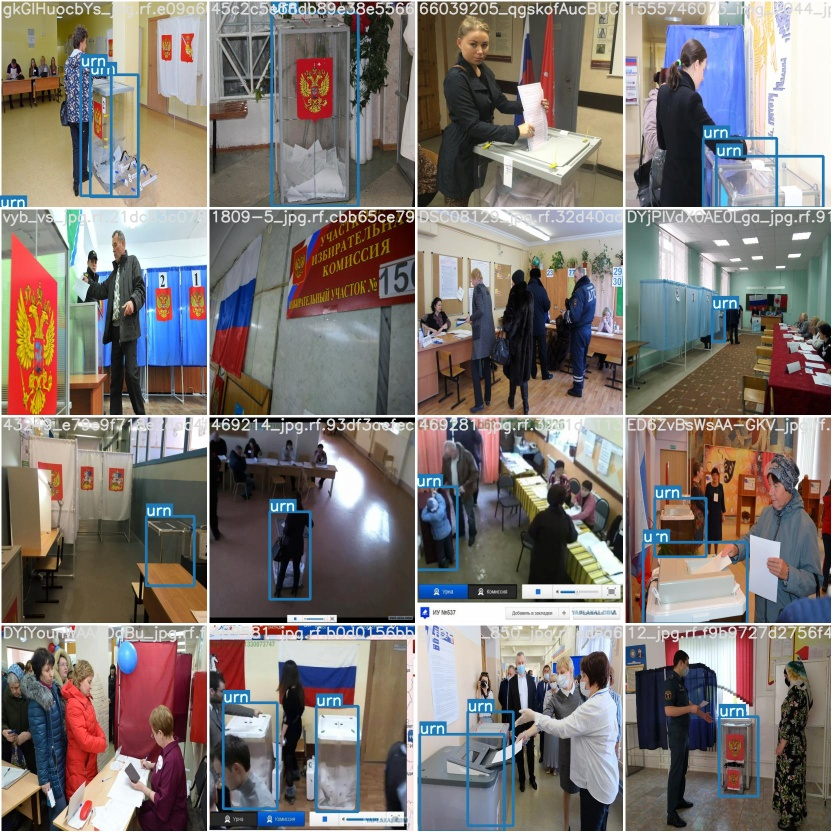

# Project objective and description

The aim of this project is to count the number of unique people voting in a room during the day.
The project is devided into several steps:

1. Custom object (an urn) detection (done)
2. People tracking (done)
3. Counting unique people (in progress)

Each of these tasks is a separate topic itself and could be generalized further to be used for other purposes.
For instance, **tasks 2 and 3** could be employed to count the number of unique customers in a shop *etc*.  

**For the description of how the problem is tackled, go directly to the 'Voting. Problem statement' section below.**

## Custom object detection 

The implementation of custom object detection could be found in a folder *urn_detection_yolov5*. 
First, the dataset of urn pictures was collected (see *urn_detection_yolov5/collecting_urn_dataset.doc*
for details). Note that the dataset has already been augmented with different brightness levels to simulate the 
effect of illumination in a room and/or bad camera settings. The dataset can be downloaded with curl.
Then, the **YOLOv5 detector** is applied with 2 classes of objects specified: an urn (a custom object) 
and a person (a coco object). The neural network is then fine tuned to learn about the custom 
object class. Finaly, the inference is done on a subset of data and the result is visualized. 

**Example of urn detection with YOLOv5**

*NB*: Since an urn is a stationary object (i.e. its position is not supposed to change in time),
the dectection can be performed on a single (initial) video frame. Then, the urn's coordinares could
be easily passed further to other frames without performing the detection task over and over again. 

## Track and count

In the second part of the project we track people in a room using the tracking-by-detection paradigm.
As it has been done earlier in the custom object detection section, **YOLOv5** performs a person
detection on each single video frame. Then, the detections on different frames must be associated 
between each other to re-identify the same person. **The SORT tracker** combines the linear Kalman filter
to predict the state of the object (*the motion model*) and the Hungarian algorithm to associate objects 
from the previous frames with objects in the current frame. The tracker does not take into account any details
of the object's appearence. My implementation of the SORT tracker inside the YOLOv5 inference script could be found in 
*track_yolov5_sort.py*. The Jupyter notebook *run_sort_tracker_on_colab.ipynb* shows how to run the
tracker on **Google Colab**.

**Example of tracking in a room using SORT and YOLOv5**

A nice alternative to the SORT tracker is a [Deep SORT](https://arxiv.org/pdf/1703.07402.pdf).
**The Deep SORT** extends the SORT tracker adding a deep association metric to build an appearance
model in addition to the motion model. According to the authors, this extension enables to track objects
through longer periods of occlusions, effectively reducing the number of identity switches. My implemention
of the tracker inside the YOLOv5 inference script could be found in *track_yolov5_deepsort.py*. The Jupyter
notebook *run_deepsort_tracker_on_colab.ipynb* shows how to run the tracker on **Google Colab**.

**Appearance features(in progress)**

There might be a situation when the security guards or the election board members approach an urn several times during the day.
We must distinguish these cases from voting. In order to do it, we save the appearance features for each person (with a unique ID) 
approaching an urn and compare them with similarity metrics already implemented in Deep SORT.

**Content:**

- track_yolov5_sort.py implements the SORT tracker in YOLOv5
- track_yolov5_deepsort.py implements the Deep SORT tracker in YOLOv5
- run_sort_tracker_on_colab.ipynb and run_deepsort_tracker_on_colab.ipynb shows how to run the trackers on google colab. 
- folder 'theory' contains the slides with summary of theoretical approaches  

## Voting. Problem statement.

Since our primary task is to count the number of unique voters but not the total number of people in a room (some people like kids
often just accomany their parents who vote), it is important to define the voting act in a more precise way. Both an urn and voters are
identified using the YOLOv5 detector which puts a bounding box around each of them. To vote, a person must come close to an urn and 
spend a certain amount of time around (i.e. the distance between the object centroids must be within a certain critical radius). This 
"certain amount of time" is necessary to distinguish the people who pass by and the ones who actually vote. This approach requires two
predefined **parameters**: 

- Critical radius
- Minimum interaction time

The person whose motion satisfies the conditions defined above can be then tracked until he/she dissapears from the camera view. The 
tracking is necessary in case the person stays in a room hanging around for a while. To further insure that we count the unique people only,
one can save an image of each tracked person inside the bound box building a database of voters in a video. When the dateset of images with
voters is built, one can run a neural network to find the unique voters based on their appearance similarity.     

**TO DO:**
- Think about the intersection of units (IoU) in support/in instead of the critical radius
- Create a set of bbox snapshots for each ID
- **Counter**: NN to identify the number of unique people from the dataset

## How to run the trackers

1. Install all dependencies:

    pip3 install -r requirements.txt

2. Download weights:
     
    ./yolov5/weights/download_weights.sh   
    ./deep_sort/deep_sort/deep/checkpoint/download_weights.sh

3. Run the tracker: YOLOv5 + (SORT, Deep SORT)

     python3 track_yolov5_sort.py --source example/running.mp4 --weights yolov5/weights/yolov5s.pt --conf 0.4 --max_age 50 --min_hits 10 --iou_threshold 0.3

     python3 track_yolov5_deepsort.py --source 'example/running.mp4' --weights 'yolov5/weights/yolov5s.pt'

     python3 deepsort_features.py --source 'example/running.mp4' --weights 'yolov5/weights/yolov5s.pt' --device "cpu"

## Theory

In order to avoid the fit-predict style of the project, I try to understanid the theory behind the modern trackers and detectors.
I summarize my knowledge in folder "theory" where I have slides and notes on related subjects (constantly updated). 

## Literature

- [Simple Online and Realtime Tracking (SORT)](https://arxiv.org/abs/1602.00763)
- [Simple Online and Realtime Tracking with a Deep Association Metric (Deep SORT)](https://arxiv.org/pdf/1703.07402.pdf)
- [Real-Time Multiple Object Tracking: A Study on the Importance of Speed by S.Murray](https://arxiv.org/pdf/1709.03572.pdf)
- [Real time multiple camera person detection and tracking by D.Baikova](https://repositorio.iscte-iul.pt/handle/10071/17743)
- [Detection-based Multi-Object Trackingin Presence of Unreliable Appearance Features by A.Kumar(UCL)](https://sites.uclouvain.be/ispgroup/uploads//Main/PHDAKC_thesis.pdf)
- [Slides on "Re-identification for multi-person tracking" by V. Sommers (UCL)](https://sites.uclouvain.be/ispgroup/uploads//ISPS/ABS220720_slides.pdf)
- [Kalman and Bayesian Filters in Python (pdf)](https://elec3004.uqcloud.net/2015/tutes/Kalman_and_Bayesian_Filters_in_Python.pdf)
- [Kalman and Bayesian Filters in Python (codes)](https://github.com/rlabbe/Kalman-and-Bayesian-Filters-in-Python)
- [Deep Cosine Metric Learning for Person Re-Identification](https://elib.dlr.de/116408/1/WACV2018.pdf)

## Codes

- [SORT](https://github.com/abewley/sort)
- [Deep SORT (TF)](https://github.com/nwojke/deep_sort), [Deep SORT (PyTorch)](https://github.com/ZQPei/deep_sort_pytorch)
- [YOLOv5+DeepSORT](https://github.com/mikel-brostrom/Yolov5_DeepSort_Pytorch)
- [Deep person reid (UCL)](https://github.com/VlSomers/deep-person-reid)
- [YOLOv4](https://github.com/AlexeyAB/darknet), [YOLOv4 PyTorch](https://github.com/Tianxiaomo/pytorch-YOLOv4)
- [YOLOv5](https://github.com/ultralytics/yolov5)
- [FilterPy library (the Kalman filter)](https://filterpy.readthedocs.io/en/latest/)

## Habr

- [Как работает Object Tracking на YOLO и DeepSort](https://habr.com/en/post/514450/)
- [Самая сложная задача в Computer Vision](https://habr.com/en/company/recognitor/blog/505694/) 
